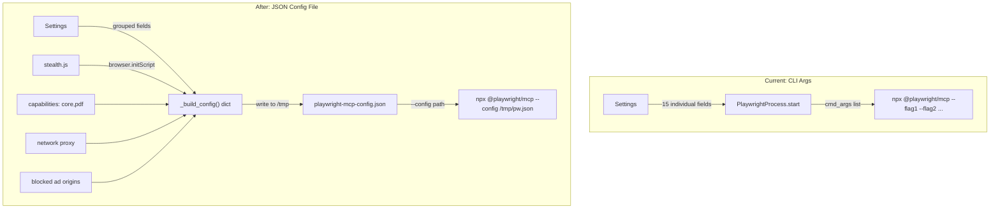
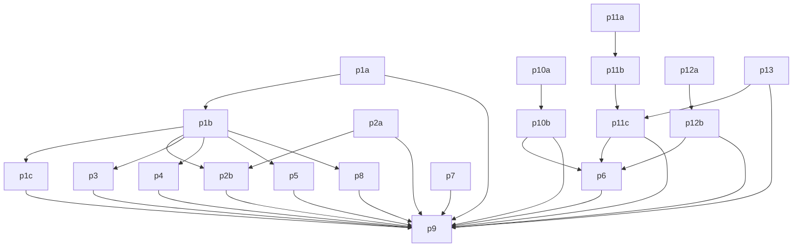

# Autonomous AI Agent: Full Implementation Plan

## Problem Statement

The current Playwright MCP integration in [`src/fast_mcp_agent/bridge/playwright.py`](src/fast_mcp_agent/bridge/playwright.py) builds **15+ CLI flags** one at a time. Every new capability requires editing three files (config, playwright.py, fastmcp.json). Worse, CLI args **cannot express nested structures** like `browser.contextOptions`, `browser.initScript`, or `network.blockedOrigins` -- blocking the biggest autonomy wins.

The agent's system prompt in [`src/fast_mcp_agent/core/conversation.py`](src/fast_mcp_agent/core/conversation.py) is a single sentence with no guidance on tool strategy, retry behavior, or multi-step research workflows. The agent loop in [`src/fast_mcp_agent/core/agent.py`](src/fast_mcp_agent/core/agent.py) has no self-correction -- if a tool fails, it just passes the error text back to the LLM and hopes for the best.

## Architecture: Before vs After



---

## Phase 1: Replace CLI Args with JSON Config File

This is the foundational change. Everything else builds on top of it.

### 1a. Add new Settings fields to [`config.py`](src/fast_mcp_agent/config.py)

Add these new fields (the existing 13 Playwright fields stay, but some get restructured):

| Field | Type | Default | Purpose |

|---|---|---|---|

| `playwright_mcp_caps` | `str` | `"core,pdf"` | Comma-separated capabilities |

| `playwright_mcp_proxy_server` | `str` | `""` | HTTP/SOCKS proxy URL |

| `playwright_mcp_proxy_bypass` | `str` | `""` | Comma-separated bypass domains |

| `playwright_mcp_blocked_origins` | `str` | `""` | Semicolon-separated blocked origins |

| `playwright_mcp_output_dir` | `str` | `""` | Output directory for traces/sessions |

| `playwright_mcp_save_trace` | `bool` | `False` | Save Playwright trace (dev mode) |

| `playwright_mcp_snapshot_mode` | `str` | `"incremental"` | Snapshot mode: incremental/full/none |

| `playwright_mcp_stealth` | `bool` | `True` | Inject anti-bot stealth script |

Remove: `playwright_mcp_extra_args` (no longer needed with JSON config)

Remove: `playwright_mcp_args` field concept (browser name now goes into the JSON config directly)

### 1b. Create `PlaywrightProcess._build_config()` method

New method on [`PlaywrightProcess`](src/fast_mcp_agent/bridge/playwright.py) that builds the full Playwright MCP JSON config dict from Settings. Maps flat Settings fields into the nested JSON schema:

```python
def _build_config(self) -> dict:
    s = self._settings
    config = {
        "browser": {
            "browserName": s.playwright_mcp_browser,
            "isolated": s.playwright_mcp_isolated,
            "launchOptions": {
                "headless": s.playwright_mcp_headless,
                "args": [],  # --no-sandbox etc.
            },
            "contextOptions": {
                "viewport": {"width": 1280, "height": 720},
                "userAgent": s.playwright_mcp_user_agent,
                "ignoreHTTPSErrors": s.playwright_mcp_ignore_https_errors,
                "serviceWorkers": "block" if s.playwright_mcp_block_service_workers else "allow",
            },
            "initScript": [],  # stealth.js path injected here
        },
        "server": {
            "port": s.playwright_mcp_port,
            "host": "localhost",
        },
        "capabilities": ["core"],  # parsed from caps field
        "sharedBrowserContext": s.playwright_mcp_shared_browser_context,
        "imageResponses": s.playwright_mcp_image_responses,
        "codegen": s.playwright_mcp_codegen,
        "console": {"level": s.playwright_mcp_console_level},
        "timeouts": {
            "action": s.playwright_mcp_timeout_action,
            "navigation": s.playwright_mcp_timeout_navigation,
        },
        "snapshot": {"mode": s.playwright_mcp_snapshot_mode},
    }
    # Conditionally add proxy, blocked origins, output, etc.
    return config
```

### 1c. Refactor `start()` and `stop()`

- `start()` calls `_build_config()`, writes result to a `tempfile.NamedTemporaryFile` (`.json`), and passes only `npx @playwright/mcp@latest --config /tmp/pw-XXXX.json` plus `--port`
- Store the temp file path as `self._config_path`
- `stop()` cleans up the temp file via `os.unlink(self._config_path)` after killing the process

This eliminates all 15+ individual `cmd_args.append()` calls.

---

## Phase 2: Anti-Bot Stealth Init Script

### 2a. Create [`src/fast_mcp_agent/browser/stealth.js`](src/fast_mcp_agent/browser/stealth.js)

JavaScript file injected into every page before the site's own scripts run. Covers:

- `Object.defineProperty(navigator, 'webdriver', {get: () => undefined})` -- removes the #1 bot signal
- Override `navigator.plugins` to report realistic Chrome plugins
- Override `navigator.languages` to `['en-US', 'en']`
- Override `navigator.platform` to match the User-Agent
- Patch `chrome.runtime` to look like a real Chrome install
- Override WebGL vendor/renderer strings to avoid fingerprint mismatches
- Patch `Permissions.prototype.query` to report correct notification status

### 2b. Wire into config

In `_build_config()`, if `s.playwright_mcp_stealth` is `True`, resolve the absolute path to `stealth.js` (using `importlib.resources` or `pathlib.Path(__file__).parent`) and add it to `config["browser"]["initScript"]`.

Add `stealth.js` to the package data in [`pyproject.toml`](pyproject.toml) so it ships with the wheel:

```toml
[tool.hatch.build.targets.wheel]
packages = ["src/fast_mcp_agent"]

[tool.hatch.build]
include = ["src/fast_mcp_agent/browser/stealth.js"]
```

---

## Phase 3: PDF Capability

In `_build_config()`, parse `s.playwright_mcp_caps` (e.g. `"core,pdf"`) into a list and set `config["capabilities"]`. Default is `["core", "pdf"]`.

This enables the agent to save web pages as PDFs and read PDF documents -- useful for research on pages that are hostile to scraping but render fine in a browser.

---

## Phase 4: Proxy Support

In `_build_config()`, if `s.playwright_mcp_proxy_server` is non-empty:

```python
config["browser"]["launchOptions"]["proxy"] = {
    "server": s.playwright_mcp_proxy_server,
}
if s.playwright_mcp_proxy_bypass:
    config["browser"]["launchOptions"]["proxy"]["bypass"] = s.playwright_mcp_proxy_bypass
```

This allows the agent to route through corporate proxies, residential proxies for geo-restricted content, or SOCKS proxies for privacy.

---

## Phase 5: Network Filtering (Ad/Tracker Blocking)

In `_build_config()`, if `s.playwright_mcp_blocked_origins` is non-empty, parse the semicolon-separated string and set:

```python
config["network"] = {
    "blockedOrigins": blocked_list
}
```

Pre-populate a sensible default in the `Settings` field:

```
https://www.googletagmanager.com;https://www.google-analytics.com;https://connect.facebook.net;https://cdn.segment.com
```

This prevents ad trackers from loading, which speeds up page loads and reduces noise in accessibility snapshots.

---

## Phase 6: Enhanced Autonomous System Prompt

Rewrite `_SYSTEM_PROMPT` in [`src/fast_mcp_agent/core/conversation.py`](src/fast_mcp_agent/core/conversation.py) from the current 4 lines to a comprehensive autonomous agent prompt. The new prompt will cover:

1. **Identity and purpose**: "You are an autonomous AI research agent..."
2. **Available tool categories**:

   - Web search (RivalSearchMCP)
   - Browser automation (Playwright MCP)
   - Slack communication (Slack Bolt -- internal: send/read messages, channels, threads, reactions)
   - Google Workspace (Google Workspace MCP -- Gmail, Drive, Calendar, Sheets, Docs, Slides, Forms, Tasks, Chat)
   - Cron scheduling (internal -- create/list/delete scheduled recurring tasks)

3. **Research methodology**: Search first, then browse for details, verify across multiple sources
4. **Tool usage strategy**: When to use search vs browser, when to use Gmail vs Slack, how to schedule recurring tasks
5. **Error recovery**: Explicit instructions for retry strategies when tools fail
6. **Output format**: Always cite sources, structure answers with headings, include relevant URLs
7. **Constraints**: Token budget awareness, do not hallucinate, admit uncertainty
8. **Workspace awareness**: How to compose emails, create calendar events, read/write Google Sheets, interact with Drive

**Dependency**: This phase now depends on p10b (Google Workspace), p11c (Slack Bolt), and p12b (Cron) being complete, so the prompt can accurately describe all available tool categories.

This is the single highest-impact change for autonomous behavior -- the system prompt is what tells the LLM *how* to be an agent.

---

## Phase 7: Agent Loop Self-Correction and Retry Logic

Upgrade [`src/fast_mcp_agent/core/agent.py`](src/fast_mcp_agent/core/agent.py) with:

1. **Tool call retry**: If `result_text.startswith("[error]")`, automatically retry the tool call once with the same arguments before passing the error to the LLM. Add a `_retry_tool_call()` helper.

2. **Consecutive failure detection**: Track consecutive tool failures. If 3+ tool calls fail in a row, inject a system message telling the LLM to change strategy.

3. **Stuck-loop detection**: If the LLM calls the same tool with the same arguments twice in a row, inject a system message: "You already tried this. Use a different approach."

4. **Graceful degradation on max iterations**: Instead of the generic "I reached maximum steps" message, summarize what was accomplished: which tools were called, what information was gathered.

Key implementation detail -- these changes are all within the existing `for iteration in range(...)` loop. No new dependencies or structural changes needed.

---

## Phase 8: Dev Mode Debugging (Trace + Output Dir)

In `_build_config()`, conditionally enable debugging features when `s.playwright_mcp_save_trace` is True:

```python
if s.playwright_mcp_save_trace:
    config["saveTrace"] = True
    config["outputDir"] = s.playwright_mcp_output_dir or "/tmp/pw-traces"
    config["outputMode"] = "file"
```

This lets developers replay exact browser sessions for debugging. Only enabled in dev mode.

---

## Phase 9: Update Config Files, Env Vars, and Lint

### 9a. Update [`fastmcp.json`](fastmcp.json) and [`dev.fastmcp.json`](dev.fastmcp.json)

Add new Playwright env vars:

- `PLAYWRIGHT_MCP_CAPS`
- `PLAYWRIGHT_MCP_PROXY_SERVER`
- `PLAYWRIGHT_MCP_PROXY_BYPASS`
- `PLAYWRIGHT_MCP_BLOCKED_ORIGINS`
- `PLAYWRIGHT_MCP_OUTPUT_DIR`
- `PLAYWRIGHT_MCP_SAVE_TRACE`
- `PLAYWRIGHT_MCP_SNAPSHOT_MODE`
- `PLAYWRIGHT_MCP_STEALTH`

Add Google Workspace MCP env vars:

- `GOOGLE_WORKSPACE_MCP_URL`
- `GOOGLE_WORKSPACE_MCP_ENABLED`

Add Slack Bolt env vars (replacing Slack MCP):

- `SLACK_BOT_TOKEN`
- `SLACK_APP_TOKEN`
- `SLACK_SIGNING_SECRET`
- `SLACK_ENABLED`

Add Cron env vars:

- `CRON_ENABLED`
- `CRON_TIMEZONE`

Remove obsolete:

- `PLAYWRIGHT_MCP_ARGS` (no longer needed -- browser name is in JSON config)
- `SLACK_MCP_URL` (replaced by Slack Bolt)
- `SLACK_MCP_ENABLED` (replaced by `SLACK_ENABLED`)

For `dev.fastmcp.json` specifically, set `PLAYWRIGHT_MCP_SAVE_TRACE` default to `true`.

### 9b. Create `src/fast_mcp_agent/browser/__init__.py`

New subpackage for browser-related assets (just the `__init__.py` and `stealth.js`).

### 9c. Update [`pyproject.toml`](pyproject.toml)

Add new dependencies:

```toml
dependencies = [
    # ... existing ...
    "slack-bolt>=1.20.0",              # Slack Bolt Python (async)
    "apscheduler>=3.10.0",            # Async cron scheduler
    "cron-descriptor>=1.4.0",          # Human-readable cron descriptions
    "python-crontab>=3.2.0",           # Crontab parsing and validation
    "google-api-python-client>=2.140.0",  # Google Workspace API client
    "google-auth-oauthlib>=1.2.0",     # OAuth for Google services
    "google-auth-httplib2>=0.2.0",     # HTTP transport for Google auth
]
```

Add browser package data:

```toml
[tool.hatch.build]
include = ["src/fast_mcp_agent/browser/stealth.js"]
```

### 9d. Final lint pass

Run `ruff check` and `ruff format` across all modified files. Run Python import verification.

---

## Phase 10: Google Workspace MCP Integration

### Architecture Decision

The `workspace-mcp` server by taylorwilsdon is a production-ready FastMCP-based MCP server that provides **83 tools** across 10 Google services (Gmail, Drive, Calendar, Sheets, Docs, Slides, Forms, Tasks, Chat, Custom Search). It uses OAuth 2.0 with a `client_secret.json` credentials file.

**Integration approach**: Connect to `workspace-mcp` as an **external MCP server** via our MCPBridge -- exactly the same pattern we use for RivalSearchMCP and Playwright MCP. This is the cleanest approach because:

- Requires minimal code changes (just add a new client in MCPBridge)
- Gets us 83 tools automatically via MCP tool discovery
- Uses the proven MCP client connection pattern
- Only needs env vars for OAuth credentials + the server URL
- `workspace-mcp` handles all Google auth, token refresh, and API calls internally

### 10a. Add Google Workspace MCP settings to [`config.py`](src/fast_mcp_agent/config.py)

```python
# ── Google Workspace MCP (optional) ───────────────────────────
google_workspace_mcp_url: str = Field(
    default="",
    description="Streamable HTTP URL for the Google Workspace MCP server.",
)
google_workspace_mcp_enabled: bool = Field(
    default=True,
    description="Whether to attempt connecting to Google Workspace MCP on startup.",
)
```

### 10b. Add Google Workspace MCP client to MCPBridge

In [`src/fast_mcp_agent/bridge/manager.py`](src/fast_mcp_agent/bridge/manager.py):

1. Add `_gw_client: Client | None = None` and `_gw_tools: dict` to `__init__`
2. Add `_GW_PREFIX = "gw_"` constant for collision avoidance
3. In `connect()`, conditionally connect to Google Workspace MCP (same pattern as Slack MCP -- graceful degradation on failure)
4. In `_build_routing()`, add Google Workspace tools after Slack tools with `gw_` prefix on collision
5. In `_get_tool_registry()` and `_get_client()`, add `"gw"` case
6. In `disconnect()`, close the Google Workspace client
7. In `connected_servers`, add `"GoogleWorkspaceMCP"` when connected

### Uphill/Downhill Effects of Phase 10

| Affected File | Change Required | Reason |

|---|---|---|

| `config.py` | Add 2 fields | Settings for GW MCP URL and enabled flag |

| `bridge/manager.py` | Add GW client, routing, discovery | Core integration point |

| `mcp/server.py` | Update `agent_status` resource | Show `google_workspace_connected` |

| `models.py` | Add `google_workspace_connected` to AgentStatus | Status reporting |

| `core/conversation.py` | Update system prompt | Tell LLM about Gmail, Drive, Calendar tools |

| `fastmcp.json` / `dev.fastmcp.json` | Add env vars | `GOOGLE_WORKSPACE_MCP_URL`, `GOOGLE_WORKSPACE_MCP_ENABLED` |

| `mcp/server.py` instructions | Update instructions string | Mention Google Workspace capabilities |

### Google Workspace MCP Setup (for users)

Users need to:

1. Set up OAuth 2.0 credentials in Google Cloud Console
2. Download `client_secret.json` to project root
3. Run `workspace-mcp` server: `uvx workspace-mcp --tool-tier core`
4. Set `GOOGLE_WORKSPACE_MCP_URL` to the server's HTTP endpoint

---

## Phase 11: Replace Slack MCP with Slack Bolt Python

### Architecture Decision

Replace the external Slack MCP server (connected via Streamable HTTP) with **Slack Bolt Python** (`slack-bolt`), running natively as an async Python library within our agent process.

**Why replace**:

- Eliminates external process dependency (no separate Slack MCP server to run)
- Native Python = better error handling, debugging, typing
- `slack-bolt` has async support (`AsyncApp`) that integrates directly with our asyncio event loop
- We control exactly which tools are exposed and their schemas
- Easier to add custom Slack logic (e.g., formatting, thread management)

**Integration approach**: Create internal Python tool functions that wrap Slack Bolt calls. These internal tools are exposed to the LLM via the same OpenAI function-calling format used by MCPBridge tools. Phase 13 extends the MCPBridge to route to both external MCP tools and internal Python tools.

### 11a. Update Settings in [`config.py`](src/fast_mcp_agent/config.py)

**Remove** the existing Slack MCP settings:

```python
# REMOVE these:
slack_mcp_url: str = Field(...)
slack_mcp_enabled: bool = Field(...)
```

**Add** Slack Bolt settings:

```python
# ── Slack Bolt Python (optional) ──────────────────────────────
slack_bot_token: str = Field(
    default="",
    description="Slack Bot Token (xoxb-...) for Slack Bolt.",
)
slack_app_token: str = Field(
    default="",
    description="Slack App Token (xapp-...) for Socket Mode.",
)
slack_signing_secret: str = Field(
    default="",
    description="Slack signing secret for request verification.",
)
slack_enabled: bool = Field(
    default=True,
    description="Whether to initialize Slack Bolt on startup.",
)
```

### 11b. Create `src/fast_mcp_agent/slack/` subpackage

**New files**:

- `src/fast_mcp_agent/slack/__init__.py` -- re-exports
- `src/fast_mcp_agent/slack/client.py` -- `SlackService` class wrapping `AsyncWebClient`
- `src/fast_mcp_agent/slack/tools.py` -- Internal tool definitions with OpenAI function schemas

`SlackService` class:

```python
class SlackService:
    """Async wrapper around Slack Bolt's AsyncWebClient."""

    def __init__(self, bot_token: str) -> None:
        from slack_sdk.web.async_client import AsyncWebClient
        self._client = AsyncWebClient(token=bot_token)
        self._started = False

    async def start(self) -> None:
        # Verify auth
        resp = await self._client.auth_test()
        self._started = True

    async def stop(self) -> None:
        self._started = False

    # Tool methods:
    async def send_message(self, channel: str, text: str, thread_ts: str | None = None) -> dict
    async def get_channel_history(self, channel: str, limit: int = 20) -> list[dict]
    async def search_messages(self, query: str, count: int = 10) -> list[dict]
    async def list_channels(self, limit: int = 100) -> list[dict]
    async def get_thread_replies(self, channel: str, thread_ts: str) -> list[dict]
    async def add_reaction(self, channel: str, timestamp: str, name: str) -> bool
    async def get_user_info(self, user_id: str) -> dict
```

`tools.py` -- defines internal tool schemas and handlers:

```python
SLACK_TOOLS: list[dict] = [
    {
        "name": "slack_send_message",
        "description": "Send a message to a Slack channel or thread.",
        "inputSchema": {
            "type": "object",
            "properties": {
                "channel": {"type": "string", "description": "Channel ID or #name"},
                "text": {"type": "string", "description": "Message text"},
                "thread_ts": {"type": "string", "description": "Thread timestamp (optional)"},
            },
            "required": ["channel", "text"],
        },
    },
    # ... more tools for get_history, search, list_channels, etc.
]

async def handle_slack_tool(service: SlackService, name: str, args: dict) -> str:
    """Route an internal Slack tool call to the correct SlackService method."""
    ...
```

### 11c. Remove Slack MCP from MCPBridge, wire Slack Bolt into bridge routing

In [`src/fast_mcp_agent/bridge/manager.py`](src/fast_mcp_agent/bridge/manager.py):

1. **Remove** `_slack_client`, `_slack_tools`, `_SLACK_PREFIX`
2. **Remove** the Slack MCP connection block in `connect()`
3. **Remove** `"slack"` case from `_get_tool_registry()` and `_get_client()`
4. **Remove** `"SlackMCP"` from `connected_servers`
5. **Add** internal Slack tools via the Phase 13 internal tool router

In [`src/fast_mcp_agent/mcp/server.py`](src/fast_mcp_agent/mcp/server.py):

1. In `agent_lifespan`, initialize `SlackService` and start it
2. Pass `SlackService` instance into the lifespan context and DI
3. Update `agent_status` resource to use `slack_connected` from SlackService

### Uphill/Downhill Effects of Phase 11

| Affected File | Change Required | Reason |

|---|---|---|

| `config.py` | Remove 2 fields, add 4 fields | Slack MCP → Slack Bolt settings |

| `bridge/manager.py` | Remove Slack MCP client and routing | No longer external MCP |

| `mcp/server.py` | Add SlackService to lifespan + DI | New lifecycle managed service |

| `mcp/dependencies.py` | Add `get_slack_service` dep | DI for Slack service |

| `models.py` | Keep `slack_connected` in AgentStatus | Status still reported |

| `core/conversation.py` | Update system prompt | Slack tools now have different names/capabilities |

| `core/agent.py` | Handle internal tool calls alongside MCP tool calls | Routing change |

| `mcp/server.py` instructions | Update instructions string | Mention Slack Bolt capabilities |

---

## Phase 12: Cron Job Scheduler

### Architecture Decision

Use **APScheduler** (`AsyncIOScheduler` with `CronTrigger`) for in-process cron scheduling, **cron-descriptor** for human-readable schedule descriptions, and **python-crontab** for cron expression parsing/validation. Cron job definitions are persisted in Neon for durability across restarts.

The agent can create, list, and delete scheduled tasks. Each task stores:

- A cron expression (e.g., `"0 9 * * 1-5"`)
- An action type (e.g., `"search"`, `"slack_message"`, `"email"`)
- Action parameters (JSON)
- A human-readable description (auto-generated by cron-descriptor)

### 12a. Add cron scheduler settings to [`config.py`](src/fast_mcp_agent/config.py)

```python
# ── Cron Scheduler (optional) ─────────────────────────────────
cron_enabled: bool = Field(
    default=True,
    description="Whether to start the cron scheduler on startup.",
)
cron_timezone: str = Field(
    default="UTC",
    description="Timezone for cron job evaluation (e.g. 'America/New_York').",
)
```

### 12b. Create `src/fast_mcp_agent/scheduler/` subpackage

**New files**:

- `src/fast_mcp_agent/scheduler/__init__.py` -- re-exports
- `src/fast_mcp_agent/scheduler/service.py` -- `CronSchedulerService` class
- `src/fast_mcp_agent/scheduler/tools.py` -- Internal tool definitions with OpenAI function schemas

`CronSchedulerService`:

```python
class CronSchedulerService:
    """Manages cron jobs using APScheduler, persisted in Neon."""

    def __init__(self, pool: asyncpg.Pool | None, timezone: str = "UTC") -> None:
        from apscheduler.schedulers.asyncio import AsyncIOScheduler
        self._scheduler = AsyncIOScheduler(timezone=timezone)
        self._pool = pool

    async def start(self) -> None:
        # Create cron_jobs table if not exists
        # Load existing jobs from Neon
        # Add them to scheduler
        self._scheduler.start()

    async def stop(self) -> None:
        self._scheduler.shutdown(wait=False)

    async def create_job(self, cron_expr: str, action_type: str, params: dict, description: str = "") -> dict:
        """Create a new cron job, persist to Neon, schedule in APScheduler."""
        from cron_descriptor import get_description
        human_desc = get_description(cron_expr)
        # Insert into cron_jobs table
        # Add to scheduler
        return {"id": job_id, "cron": cron_expr, "description": human_desc, ...}

    async def list_jobs(self) -> list[dict]:
        """List all cron jobs from Neon."""

    async def delete_job(self, job_id: str) -> bool:
        """Delete a cron job from Neon and APScheduler."""
```

**Neon schema addition** (in [`storage/schema.sql`](src/fast_mcp_agent/storage/schema.sql)):

```sql
CREATE TABLE IF NOT EXISTS cron_jobs (
    id          UUID PRIMARY KEY DEFAULT gen_random_uuid(),
    cron_expr   TEXT NOT NULL,
    action_type TEXT NOT NULL,
    params      JSONB NOT NULL DEFAULT '{}',
    description TEXT NOT NULL DEFAULT '',
    human_desc  TEXT NOT NULL DEFAULT '',
    enabled     BOOLEAN NOT NULL DEFAULT TRUE,
    created_at  TIMESTAMPTZ NOT NULL DEFAULT now(),
    updated_at  TIMESTAMPTZ NOT NULL DEFAULT now(),
    last_run_at TIMESTAMPTZ
);
```

`tools.py` -- internal tool schemas:

```python
CRON_TOOLS: list[dict] = [
    {
        "name": "cron_create_job",
        "description": "Schedule a recurring task with a cron expression.",
        "inputSchema": {
            "type": "object",
            "properties": {
                "cron_expr": {"type": "string", "description": "Cron expression (e.g. '0 9 * * 1-5')"},
                "action_type": {"type": "string", "description": "Action: 'search', 'slack_message', 'email', etc."},
                "params": {"type": "object", "description": "Action-specific parameters"},
                "description": {"type": "string", "description": "Human description of what this job does"},
            },
            "required": ["cron_expr", "action_type", "params"],
        },
    },
    {
        "name": "cron_list_jobs",
        "description": "List all scheduled cron jobs.",
        "inputSchema": {"type": "object", "properties": {}},
    },
    {
        "name": "cron_delete_job",
        "description": "Delete a scheduled cron job by ID.",
        "inputSchema": {
            "type": "object",
            "properties": {"job_id": {"type": "string"}},
            "required": ["job_id"],
        },
    },
]
```

### Uphill/Downhill Effects of Phase 12

| Affected File | Change Required | Reason |

|---|---|---|

| `config.py` | Add 2 fields | Cron settings |

| `storage/schema.sql` | Add `cron_jobs` table | Persistent job storage |

| `storage/conversations.py` | Add migration for cron_jobs | Schema migration |

| `mcp/server.py` | Add CronSchedulerService to lifespan + DI | New lifecycle service |

| `mcp/dependencies.py` | Add `get_scheduler` dep | DI for scheduler |

| `models.py` | Add `cron_enabled` to AgentStatus | Status reporting |

| `core/conversation.py` | Update system prompt | Tell LLM about cron tools |

| `core/agent.py` | Handle cron tool calls via internal routing | Routing |

---

## Phase 13: Extend MCPBridge with Internal Tool Routing

### Architecture Decision

The MCPBridge currently only routes to external MCP servers. With Slack Bolt and Cron becoming internal Python tools, the bridge needs to handle **both** external MCP tool calls and internal Python tool calls through the same interface.

### Implementation

Add to [`src/fast_mcp_agent/bridge/manager.py`](src/fast_mcp_agent/bridge/manager.py):

```python
from collections.abc import Callable, Awaitable

# Type for internal tool handlers
InternalToolHandler = Callable[[str, dict[str, Any]], Awaitable[str]]

class MCPBridge:
    def __init__(self, settings: Settings) -> None:
        # ... existing ...
        self._internal_tools: dict[str, dict[str, Any]] = {}
        self._internal_handlers: dict[str, InternalToolHandler] = {}

    def register_internal_tools(
        self,
        tools: list[dict[str, Any]],
        handler: InternalToolHandler,
        source: str,
    ) -> None:
        """Register internal Python tool definitions and their handler."""
        for tool in tools:
            name = tool["name"]
            self._internal_tools[name] = tool
            self._internal_handlers[name] = handler
            # Route directly -- internal tools already have unique names
            self._routing[name] = ("internal", name)

    async def call_tool(self, tool_name: str, arguments: dict[str, Any]) -> str:
        # Check internal tools first
        if tool_name in self._internal_handlers:
            try:
                return await self._internal_handlers[tool_name](tool_name, arguments)
            except Exception as exc:
                return f"[error] Internal tool '{tool_name}' failed: {exc}"
        # Fall through to MCP routing
        # ... existing logic ...
```

In `get_openai_tools()`, also include internal tool schemas alongside MCP tool schemas.

### Wiring in lifespan

In [`mcp/server.py`](src/fast_mcp_agent/mcp/server.py) `agent_lifespan`:

```python
# After MCPBridge.connect():

# Register Slack Bolt internal tools
if slack_service and slack_service._started:
    from fast_mcp_agent.slack.tools import SLACK_TOOLS, handle_slack_tool
    bridge.register_internal_tools(
        SLACK_TOOLS,
        handler=lambda name, args: handle_slack_tool(slack_service, name, args),
        source="slack",
    )

# Register Cron internal tools
if cron_scheduler:
    from fast_mcp_agent.scheduler.tools import CRON_TOOLS, handle_cron_tool
    bridge.register_internal_tools(
        CRON_TOOLS,
        handler=lambda name, args: handle_cron_tool(cron_scheduler, name, args),
        source="cron",
    )
```

---

## Files Modified (Summary)

| File | Change |

|---|---|

| `src/fast_mcp_agent/config.py` | Add 8 Playwright + 2 GW + 4 Slack + 2 Cron fields; remove 3 old Slack/PW fields |

| `src/fast_mcp_agent/bridge/playwright.py` | Replace CLI builder with `_build_config()` + JSON file |

| `src/fast_mcp_agent/bridge/manager.py` | Remove Slack MCP; add GW MCP client; add internal tool routing |

| `src/fast_mcp_agent/browser/__init__.py` | New empty init |

| `src/fast_mcp_agent/browser/stealth.js` | New anti-bot script |

| `src/fast_mcp_agent/slack/__init__.py` | New subpackage init |

| `src/fast_mcp_agent/slack/client.py` | New SlackService wrapping AsyncWebClient |

| `src/fast_mcp_agent/slack/tools.py` | New internal tool definitions for Slack |

| `src/fast_mcp_agent/scheduler/__init__.py` | New subpackage init |

| `src/fast_mcp_agent/scheduler/service.py` | New CronSchedulerService with APScheduler |

| `src/fast_mcp_agent/scheduler/tools.py` | New internal tool definitions for Cron |

| `src/fast_mcp_agent/storage/schema.sql` | Add `cron_jobs` table |

| `src/fast_mcp_agent/storage/conversations.py` | Add migration for cron_jobs table |

| `src/fast_mcp_agent/core/conversation.py` | Rewrite system prompt for all tool categories |

| `src/fast_mcp_agent/core/agent.py` | Add retry, stuck-loop, consecutive-failure logic |

| `src/fast_mcp_agent/models.py` | Add `google_workspace_connected`, `cron_enabled` to AgentStatus |

| `src/fast_mcp_agent/mcp/server.py` | Add GW, Slack, Cron to lifespan; update instructions; update status |

| `src/fast_mcp_agent/mcp/dependencies.py` | Add `get_slack_service`, `get_scheduler` deps |

| `fastmcp.json` | Add all new env vars; remove obsolete |

| `dev.fastmcp.json` | Add all new env vars; enable trace in dev |

| `pyproject.toml` | Add 6 new dependencies; add browser package data |

## Dependency Graph



## Risks and Mitigations

- **Temp file left behind on crash**: Use `atexit` or ensure `finally` block in lifespan cleans up. `tempfile.NamedTemporaryFile(delete=False)` with explicit cleanup in `stop()`.
- **stealth.js path resolution in packaged wheels**: Use `importlib.resources.files()` for reliable path resolution across install modes.
- **Breaking existing Settings**: All new fields have defaults. Existing `.env` files continue to work unchanged.
- **Slack Bolt auth failure**: `SlackService.start()` wraps `auth_test()` in try/except. On failure, log warning and continue without Slack tools (graceful degradation, same as Slack MCP before).
- **Google Workspace MCP not running**: Same graceful degradation pattern -- if connection fails, agent continues without Google Workspace tools. The MCPBridge `connect()` already handles this pattern.
- **APScheduler crash on malformed cron**: `cron_descriptor` validates expressions; APScheduler's `CronTrigger.from_crontab()` also validates. We wrap creation in try/except and return a clear error to the LLM.
- **Cron jobs lost on restart**: Jobs persist in Neon `cron_jobs` table. On startup, `CronSchedulerService.start()` reloads all enabled jobs from the database.
- **Internal tool name collision with MCP tools**: Internal tools use explicit prefixes (`slack_`, `cron_`) that don't collide with RivalSearch/Playwright/GoogleWorkspace MCP tool names.
- **google-api-python-client vs workspace-mcp**: We chose `workspace-mcp` as an external MCP server rather than direct `google-api-python-client` integration because it handles all OAuth, token refresh, and API calls internally. If the user prefers direct integration later, the internal tool pattern from Phase 13 supports it.