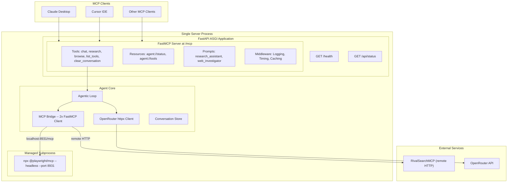
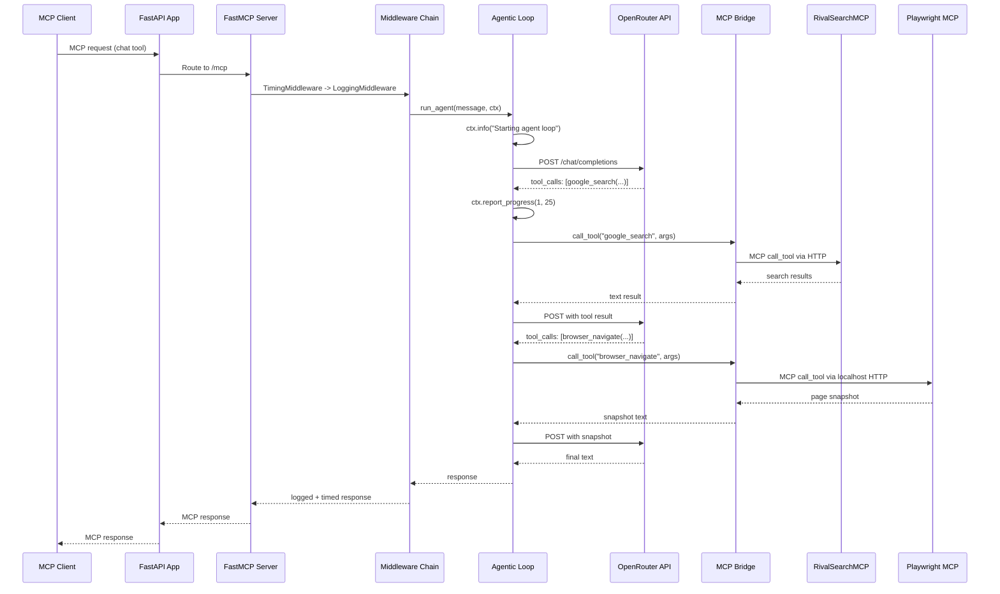

# FastMCP AI Agent -- Updated Implementation Plan

## Architecture Overview

A **FastAPI application** mounts a **FastMCP server** as an ASGI sub-application at `/mcp`. On startup, the lifespan spawns **Playwright MCP** as a Node.js subprocess (`npx @playwright/mcp@latest --headless --port 8931`), then connects two **FastMCP Client** instances (RivalSearchMCP via remote HTTP, Playwright MCP via localhost HTTP). An **agentic loop** powered by **OpenRouter** (direct httpx) reasons over discovered tool sets. All FastMCP v2.14.x server and client features are utilized.



---

## FastMCP Feature Coverage Checklist

Every feature from the user-provided documentation list is mapped to a specific module:

### Server Features

| Feature | Module | Implementation |

|---------|--------|----------------|

| Tools | `server.py` | `@mcp.tool` with tags, annotations, output_schema, timeout |

| Resources | `server.py` | `@mcp.resource` for agent status, tool catalog |

| Prompts | `server.py` | `@mcp.prompt` for research_assistant, web_investigator |

| Context | `server.py` | `ctx: Context` injected via DI for logging, progress, elicitation |

| Background Tasks | `server.py` | `@mcp.tool(task=True)` on `research` tool (long-running) |

| Dependency Injection | `server.py` | `Context` type annotation, custom `Depends()` for bridge/settings |

| Elicitation | `server.py` | `ctx.elicit()` in browse tool to confirm navigation |

| Icons | `server.py` | Server-level icon via `FastMCP("name", icon="magnifying-glass")` |

| Lifespan | `app.py` | `combine_lifespans` merging FastAPI + MCP lifespans |

| Logging | `server.py`, `middleware.py` | `ctx.info()`, `ctx.warning()` + LoggingMiddleware |

| Middleware | `middleware.py` | TimingMiddleware, LoggingMiddleware, ResponseCachingMiddleware |

| Pagination | `server.py` | Cursor-based pagination on list_tools (large tool catalog) |

| Progress | `server.py` | `ctx.report_progress()` in research tool loop |

| Sampling | `server.py` | `ctx.sample()` for delegating to client LLM when applicable |

| Storage Backends | `app.py` | In-memory default, documented Redis swap |

| Versioning | `server.py` | `FastMCP("name", version="1.0.0")` |

| Transforms/Namespace | `server.py` | Not needed (no mounted sub-servers), but documented pattern |

| Visibility | `server.py` | Tag-based filtering with `include_tags`/`exclude_tags` |

| Tool Transformation | `server.py` | Documented pattern for future use |

### Client Features (on the 2 FastMCP Client instances in bridge.py)

| Feature | Module | Implementation |

|---------|--------|----------------|

| Notifications | `bridge.py` | `notification_handler` on Client for server disconnect events |

| Sampling | `bridge.py` | `sampling_handler` (no-op, external servers unlikely to request) |

| Elicitation | `bridge.py` | `elicitation_handler` (no-op, external servers unlikely to request) |

| Tasks | `bridge.py` | Client task polling for background tool results |

| Progress | `bridge.py` | `progress_handler` for tracking long-running Playwright operations |

| Logging | `bridge.py` | `log_handler` to capture and forward server log messages |

| Roots | `bridge.py` | `roots` configuration for workspace context |

---

## Key Decisions (unchanged + additions)

1. **FastMCP v2.14.x** (stable) over v3.0 (beta) -- enterprise stability requirement
2. **httpx for OpenRouter** -- SDK is beta, direct API gives full control over tool-calling format
3. **FastAPI mount pattern** -- REST + MCP from single process, `combine_lifespans`
4. **Playwright MCP as managed subprocess** -- Full 34+ tools, ref system, all capabilities
5. **StreamableHttp for RivalSearchMCP** -- remote HTTP endpoint
6. **pydantic-settings** -- type-safe config, validates on boot
7. **In-memory stores** -- conversation + cache + event store, Redis swap documented
8. **All FastMCP middleware** -- Timing + Logging + Caching from day one
9. **Background tasks on research tool** -- long-running web research uses `task=True`

---

## Project Structure

```
fast-mcp-agent/
    pyproject.toml
    .env.example
    src/
        fast_mcp_agent/
            __init__.py
            config.py              # pydantic-settings
            app.py                 # FastAPI + FastMCP ASGI composition
            server.py              # FastMCP server: tools, resources, prompts
            middleware.py           # Custom MCP middleware (timing, logging, caching)
            bridge.py              # MCPBridge: 2x FastMCP Client instances
            llm.py                 # OpenRouter client (httpx)
            agent.py               # Agentic loop
            models.py              # Pydantic data models
            conversation.py        # Conversation state store
            playwright_process.py  # Node.js subprocess manager
```

Each module stays under ~300 lines. Single responsibility per file.

---

## Module Details

### `config.py`

- `pydantic_settings.BaseSettings` with `env_file=".env"`
- Fields: `openrouter_api_key`, `openrouter_model`, `openrouter_base_url`, `rival_search_url`, `playwright_mcp_port`, `playwright_mcp_headless`, `playwright_mcp_args`, `auto_start_playwright`, `max_iterations`, `max_tool_result_length`
- Computed: `playwright_mcp_url` -> `http://localhost:{port}/mcp`

### `middleware.py`

- **TimingMiddleware**: Subclass `Middleware`, override `on_call_tool` / `on_read_resource` to measure and log execution time
- **RequestLoggingMiddleware**: Uses built-in `LoggingMiddleware` from `fastmcp.server.middleware.logging` with `include_payloads=True`
- **CachingMiddleware**: Uses `ResponseCachingMiddleware` from `fastmcp.server.middleware.caching` with TTL config for `list_tools` caching

### `server.py`

- `mcp = FastMCP("FastMCP AI Agent", version="1.0.0", instructions="...", icon="magnifying-glass")`

**Tools** (5 tools with tags, annotations):

- `chat(message, conversation_id, ctx: Context)` -- tags=["core"], the main agent entry point. Uses `ctx.info()` for logging, `ctx.report_progress()` for iteration tracking
- `research(query, depth, ctx: Context)` -- tags=["search"], `task=True` for background execution. Uses `ctx.report_progress()` and `ctx.elicit()` to confirm broad research scope
- `browse(url, action, ctx: Context)` -- tags=["browser"], delegates to Playwright tools. Uses `ctx.elicit()` to confirm navigation to sensitive domains
- `list_available_tools()` -- tags=["meta"], returns catalog of all bridge tools
- `clear_conversation(conversation_id)` -- tags=["meta"], clears state

**Resources** (2 resources):

- `@mcp.resource("agent://status")` -- returns bridge connection status, tool count, uptime
- `@mcp.resource("agent://tools/{server_name}")` -- resource template returning tools per connected server

**Prompts** (2 prompts):

- `@mcp.prompt` `research_assistant(topic)` -- returns system+user messages for deep research workflow
- `@mcp.prompt` `web_investigator(url, question)` -- returns messages for browser-based investigation

**Context usage throughout**:

- `ctx.info()`, `ctx.warning()`, `ctx.error()` for client logging
- `ctx.report_progress(current, total)` for progress reporting
- `ctx.elicit(message, response_type)` for interactive input
- `ctx.sample()` available but delegated to our own OpenRouter loop

### `bridge.py`

- `MCPBridge` class managing two `fastmcp.Client` instances
- Both clients configured with:
  - `log_handler` -- forwards external server logs to structlog
  - `notification_handler` -- handles server disconnect/reconnect events
  - `progress_handler` -- tracks progress from Playwright/RivalSearch operations
  - `sampling_handler` -- no-op callback (external servers unlikely to invoke)
  - `elicitation_handler` -- no-op callback
- `connect()` / `disconnect()` lifecycle methods
- `discover_tools()` -- fetches schemas from both, prefixes Playwright tools with `pw_` on collision
- `get_openai_tools()` -- converts MCP schemas to OpenAI function-calling format
- `call_tool(name, args)` -- routes to correct client, extracts text, truncates
- `get_status()` -- returns connection health for each server

### `llm.py`

- `OpenRouterClient` class wrapping `httpx.AsyncClient`
- `async send(messages, tools, tool_choice, temperature, max_tokens)` -> parsed response
- Headers: `Authorization`, `HTTP-Referer`, `X-Title`
- Retry with exponential backoff on 429/500
- Configurable timeout

### `agent.py`

- `async run_agent(message, conversation_id, bridge, llm, conversation_store, settings, ctx)` -> str
- Manages conversation history via ConversationStore
- Loop: send messages+tools to LLM -> execute tool_calls via bridge -> append results -> repeat
- Uses `ctx.report_progress(iteration, max_iterations)` each loop
- Uses `ctx.info()` to log tool calls and results to client
- Exits on: final text, max iterations, or error

### `playwright_process.py`

- `PlaywrightProcess` class:
  - `async start()`: Check port, spawn `npx @playwright/mcp@latest --headless --port {port} {args}`, poll until ready (30s timeout)
  - `async stop()`: SIGTERM, wait 5s, SIGKILL if needed
  - `is_managed` property
  - Logs subprocess stdout/stderr

### `app.py`

- FastAPI app with combined lifespan (`combine_lifespans` from fastmcp)
- Lifespan: Load Settings -> Start PlaywrightProcess -> Connect MCPBridge -> yield -> Disconnect -> Stop
- Mount MCP ASGI app at `/mcp` via `app.mount("/mcp", mcp_app)`
- REST endpoints: `GET /health`, `GET /api/status`
- No top-level CORS middleware (FastMCP handles its own)

### `models.py`

- `ChatMessage`, `ToolCall`, `ToolResult`, `AgentResponse`, `BridgeStatus`

### `conversation.py`

- `ConversationStore` with `get(id)`, `append(id, msg)`, `clear(id)` -- in-memory dict, Redis swap path documented

---

## Data Flow



---

## Dependencies (`pyproject.toml`)

```toml
[project]
dependencies = [
    "fastmcp[tasks]>=2.14,<3.0",
    "fastapi>=0.115",
    "uvicorn[standard]>=0.30",
    "httpx>=0.27",
    "pydantic-settings>=2.0",
    "python-dotenv>=1.0",
    "structlog>=24.0",
]
```

`fastmcp[tasks] `includes Docket for background task support. No `playwright` Python package needed.

---

## `.env.example`

```
OPENROUTER_API_KEY=sk-or-...
OPENROUTER_MODEL=openai/gpt-4o
OPENROUTER_BASE_URL=https://openrouter.ai/api/v1
RIVAL_SEARCH_URL=https://RivalSearchMCP.fastmcp.app/mcp
PLAYWRIGHT_MCP_PORT=8931
PLAYWRIGHT_MCP_HEADLESS=true
PLAYWRIGHT_MCP_ARGS=--browser chromium
AUTO_START_PLAYWRIGHT=true
MAX_ITERATIONS=25
MAX_TOOL_RESULT_LENGTH=15000
```

---

## Deployment

```bash
# Dev (single command, starts everything)
uv run uvicorn fast_mcp_agent.app:app --host 0.0.0.0 --port 8000 --reload

# Production (external Playwright MCP)
AUTO_START_PLAYWRIGHT=false uv run uvicorn fast_mcp_agent.app:app --host 0.0.0.0 --port 8000 --workers 4
```

MCP clients connect to: `http://localhost:8000/mcp`

---

## Risks and Mitigations

| Risk | Mitigation |

|------|------------|

| Node.js/npx not installed | Clear error at startup with install instructions |

| Playwright subprocess crash | Bridge detects failure, health endpoint reflects, auto-restart possible |

| Port 8931 conflict | Configurable port, startup checks availability |

| RivalSearchMCP downtime | Graceful degradation, agent uses Playwright tools only |

| OpenRouter rate limits | Exponential backoff in LLM client |

| Large tool results | Truncation via `max_tool_result_length` |

| Lifespan not wired | Explicit `combine_lifespans` pattern from FastMCP docs |