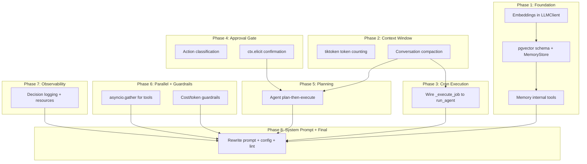

# Full Autonomous Agent Upgrade

Twelve gaps stand between the current agent and a truly autonomous system. This plan addresses each one, organized into 8 implementation phases based on dependencies.



---

## Phase 1: Long-Term Memory (OpenRouter Embeddings + pgvector)

**Gap addressed**: #2 -- Agent forgets everything between conversations.

**Architecture**: Use OpenRouter's embeddings API (`POST /api/v1/embeddings`, confirmed at https://openrouter.ai/docs/api/api-reference/embeddings/create-embeddings) to generate vectors, and Neon Postgres with the `pgvector` extension for storage and cosine-similarity retrieval.

### 1A. Add `embed()` method to [`src/fast_mcp_agent/core/llm.py`](src/fast_mcp_agent/core/llm.py)

Add a new method to `LLMClient`:

```python
async def embed(self, texts: list[str], model: str = "openai/text-embedding-3-small") -> list[list[float]]:
    """Generate embeddings via OpenRouter's embeddings endpoint."""
    payload = {"input": texts, "model": model}
    data = await self._request_with_retry(payload, endpoint="/embeddings")
    return [item["embedding"] for item in data["data"]]
```

Also update `_request_with_retry` to accept an optional `endpoint` parameter (default `/chat/completions`).

Add `openrouter_embedding_model` to [`config.py`](src/fast_mcp_agent/config.py):

```python
openrouter_embedding_model: str = Field(
    default="openai/text-embedding-3-small",
    description="Model for OpenRouter embeddings API.",
)
```

### 1B. pgvector schema + MemoryStore

New file: [`src/fast_mcp_agent/storage/memory.py`](src/fast_mcp_agent/storage/memory.py)

Add to [`storage/schema.sql`](src/fast_mcp_agent/storage/schema.sql):

```sql
CREATE EXTENSION IF NOT EXISTS vector;

CREATE TABLE IF NOT EXISTS agent_memory (
    id          SERIAL PRIMARY KEY,
    content     TEXT NOT NULL,
    category    TEXT NOT NULL DEFAULT 'general',
    embedding   vector(1536),
    metadata    JSONB NOT NULL DEFAULT '{}',
    source_conversation_id TEXT,
    created_at  TIMESTAMPTZ NOT NULL DEFAULT NOW()
);

CREATE INDEX IF NOT EXISTS idx_memory_embedding
    ON agent_memory USING ivfflat (embedding vector_cosine_ops) WITH (lists = 100);
```

`MemoryStore` class:

```python
class MemoryStore:
    def __init__(self, pool: asyncpg.Pool, llm: LLMClient) -> None: ...

    async def store(self, content: str, category: str = "general",
                    metadata: dict | None = None, conversation_id: str | None = None) -> int:
        """Embed content and store in pgvector."""

    async def recall(self, query: str, top_k: int = 5,
                     category: str | None = None) -> list[dict]:
        """Semantic search: embed query, cosine similarity against stored memories."""

    async def forget(self, memory_id: int) -> bool:
        """Delete a specific memory by ID."""
```

### 1C. Memory internal tools + bridge registration

New file: [`src/fast_mcp_agent/storage/memory_tools.py`](src/fast_mcp_agent/storage/memory_tools.py)

Three tools:

- `memory_store` -- save a fact/preference/finding for future reference
- `memory_recall` -- semantically search memories by natural language query  
- `memory_forget` -- remove a memory by ID

Register these in [`mcp/server.py`](src/fast_mcp_agent/mcp/server.py) `agent_lifespan`, same pattern as Slack/Cron tools.

Also inject `memory_recall` results into the agent loop automatically -- at the start of each `run_agent()` call, recall top 5 relevant memories based on the user message and prepend them as a system message.

---

## Phase 2: Context Window Management

**Gap addressed**: #3 -- Messages accumulate unboundedly until LLM fails.

### 2A. Token counting with tiktoken

Add `tiktoken` to [`pyproject.toml`](pyproject.toml) dependencies.

New file: [`src/fast_mcp_agent/core/tokenizer.py`](src/fast_mcp_agent/core/tokenizer.py)

```python
import tiktoken

def count_messages_tokens(messages: list[ChatMessage], model: str = "gpt-4o") -> int:
    """Count tokens for a list of messages using tiktoken."""
    enc = tiktoken.encoding_for_model(model)
    total = 0
    for msg in messages:
        total += 4  # per-message overhead
        if msg.content:
            total += len(enc.encode(msg.content))
        if msg.name:
            total += len(enc.encode(msg.name))
        if msg.tool_calls:
            for tc in msg.tool_calls:
                total += len(enc.encode(tc.function.name))
                total += len(enc.encode(tc.function.arguments))
    total += 2  # reply priming
    return total
```

### 2B. Conversation compaction

Add `compact_conversation()` to [`src/fast_mcp_agent/core/agent.py`](src/fast_mcp_agent/core/agent.py):

When `count_messages_tokens(messages)` exceeds a configurable threshold (e.g., 80% of model context window), summarize older messages:

1. Keep the system prompt and last N messages intact (the "tail")
2. Take all messages before the tail and ask the LLM to summarize them into a single compact system message
3. Replace the old messages with the summary
4. Persist the compacted conversation to Neon

Add settings to [`config.py`](src/fast_mcp_agent/config.py):

```python
context_window_limit: int = Field(default=128000, description="Model context window in tokens.")
compaction_threshold: float = Field(default=0.75, description="Compact when usage exceeds this fraction.")
compaction_tail_messages: int = Field(default=10, description="Messages to preserve during compaction.")
```

Call `compact_conversation()` at the top of each iteration in the agent loop, before calling the LLM.

---

## Phase 3: Live Cron Job Execution

**Gap addressed**: #1 -- Cron jobs fire but do nothing.

Modify [`src/fast_mcp_agent/scheduler/service.py`](src/fast_mcp_agent/scheduler/service.py) `_execute_job()`:

The `CronSchedulerService` needs access to the bridge, LLM, and store singletons. Inject these via `set_job_dependencies()` called from lifespan after all services are initialized.

```python
async def _execute_job(self, job_data: dict[str, Any]) -> None:
    """Execute a scheduled cron job by re-entering the agent loop."""
    action = job_data["action_type"]
    params = job_data["params"]

    # Construct a user message from the action type and params
    user_message = self._build_user_message(action, params)

    # Run the agent loop headlessly (no ctx, no progress reporting)
    from fast_mcp_agent.core.agent import run_agent
    resp = await run_agent(
        user_message=user_message,
        bridge=self._bridge,
        llm=self._llm,
        store=self._store,
        settings=self._settings,
        conversation_id=f"cron_{job_data['id']}",
        ctx=None,
    )
    
    # Update last_run_at
    # Log result to cron_job_runs table
```

Add a `cron_job_runs` table to track execution history with results.

Also update the `_schedule_job` call pattern -- since `_execute_job` is async and APScheduler 3.x expects sync callbacks in some configurations, ensure we're using `AsyncIOScheduler` correctly with async job functions.

---

## Phase 4: Human-in-the-Loop Confirmation

**Gap addressed**: #4 -- Agent can send messages and create jobs with zero confirmation.

FastMCP's `ctx.elicit()` is the native mechanism for this (confirmed in FastMCP docs). Since `ctx` is available in our foreground `chat` tool, we pass it through to `run_agent`.

### 4A. Action classification

Add a classification system in [`src/fast_mcp_agent/core/safety.py`](src/fast_mcp_agent/core/safety.py):

```python
from dataclasses import dataclass

# Tools classified by risk level
WRITE_TOOLS = frozenset({
    "slack_send_message", "slack_upload_file", "slack_add_reaction",
    "cron_create_job", "cron_delete_job",
    # Google Workspace write tools (gw_send_email, gw_create_event, etc.)
})

READ_TOOLS = frozenset({
    "search", "browser_navigate", "browser_snapshot",
    "slack_get_channel_history", "slack_list_channels",
    "cron_list_jobs", "memory_recall", "memory_store",
})

def requires_confirmation(tool_name: str, args: dict) -> bool:
    """Determine if a tool call needs user approval."""
    # All tools in WRITE_TOOLS need confirmation
    # Google Workspace tools starting with gw_ that send/create/delete need confirmation
    # memory_forget needs confirmation
```

### 4B. Confirmation gate in agent loop

Modify the tool execution section of [`src/fast_mcp_agent/core/agent.py`](src/fast_mcp_agent/core/agent.py):

```python
from dataclasses import dataclass

@dataclass
class ActionApproval:
    approved: bool

# In the tool call loop:
if ctx and requires_confirmation(fn_name, fn_args):
    result = await ctx.elicit(
        message=f"The agent wants to execute: {fn_name}({json.dumps(fn_args, indent=2)})\n\nApprove this action?",
        response_type=ActionApproval,
    )
    if result.action != "accept" or not result.data.approved:
        # User declined -- feed "action declined by user" back to LLM
        result_text = f"[declined] User declined to approve {fn_name}."
        # Skip execution, continue loop
        continue
```

Add a setting:

```python
require_confirmation: bool = Field(default=True, description="Require user approval for write actions.")
```

---

## Phase 5: Multi-Step Planning

**Gap addressed**: #5 -- Agent is purely reactive with no task decomposition.

Add a planning phase to [`src/fast_mcp_agent/core/agent.py`](src/fast_mcp_agent/core/agent.py):

Before entering the tool-calling loop, if the user's request is complex (heuristic: long message, contains multiple sub-tasks, or contains words like "research... then... and..."), prompt the LLM to generate a plan first:

```python
PLANNING_PROMPT = """\
Before executing, create a brief plan for this request. Output a JSON array of steps:
[{"step": 1, "action": "search for X", "tool_hint": "search"},
 {"step": 2, "action": "read the top result", "tool_hint": "browser_navigate"},
 ...]
Only include 3-7 concrete steps. Output ONLY the JSON array, no other text.
"""
```

In `run_agent()`:

1. If message length > threshold OR the LLM's first response indicates multi-step work is needed, inject a planning system message
2. Parse the plan into steps
3. Track step completion during the agent loop
4. After each tool result, check if a plan step was completed and inject progress
5. If a step fails, allow the LLM to re-plan

This is a "soft" planning approach -- the LLM generates the plan and the agent tracks it, but doesn't rigidly enforce it. The LLM retains flexibility to deviate.

---

## Phase 6: Parallel Tool Execution + Cost Guardrails

### 6A. Parallel Tool Execution

**Gap addressed**: #6 -- Tool calls are strictly sequential.

Modify the tool execution loop in [`src/fast_mcp_agent/core/agent.py`](src/fast_mcp_agent/core/agent.py):

```python
# Instead of: for tc in tool_call_payloads: ...
# Do:
async def _execute_single_tool(tc, bridge, ...):
    """Execute one tool call with retry logic."""
    ...

# Execute all tool calls in parallel
results = await asyncio.gather(
    *[_execute_single_tool(tc, bridge, ...) for tc in tool_call_payloads],
    return_exceptions=True,
)
```

Important: keep sequential execution for tool calls that are obviously dependent (e.g., `browser_navigate` then `browser_snapshot`). Heuristic: if all tool calls use different tools, run in parallel; if any two use the same tool or are browser-related, run sequentially.

### 6B. Cost and Token Guardrails

**Gap addressed**: #12 -- No limits on spending.

Add to [`config.py`](src/fast_mcp_agent/config.py):

```python
max_cost_per_conversation: float = Field(default=1.0, description="Max USD cost per conversation.")
max_cost_per_day: float = Field(default=10.0, description="Max USD cost per day.")
max_tokens_per_conversation: int = Field(default=500000, description="Max total tokens per conversation.")
```

In `run_agent()`, check accumulated `total_usage.cost` and `total_usage.total_tokens` against these limits. If exceeded, return a graceful "cost limit reached" response.

For daily limits, query `usage_logs` in Neon at the start of each conversation:

```python
async def get_daily_cost(self) -> float:
    """Sum cost from usage_logs for today."""
```

---

## Phase 7: Observability and Decision Logging

**Gap addressed**: #9 -- No structured logging of agent decisions.

### Decision log table

Add to [`storage/schema.sql`](src/fast_mcp_agent/storage/schema.sql):

```sql
CREATE TABLE IF NOT EXISTS agent_decision_logs (
    id              SERIAL PRIMARY KEY,
    conversation_id TEXT NOT NULL REFERENCES conversations(id) ON DELETE CASCADE,
    iteration       INTEGER NOT NULL,
    event_type      TEXT NOT NULL,  -- 'llm_call', 'tool_selected', 'plan_step', 'compaction', 'confirmation', 'memory_recall'
    details         JSONB NOT NULL DEFAULT '{}',
    created_at      TIMESTAMPTZ NOT NULL DEFAULT NOW()
);
```

In `run_agent()`, log key decisions:

- Which tools the LLM selected and why (from the assistant message content)
- Compaction events
- Confirmation accept/decline
- Memory recall results
- Plan step completion

### New MCP resources

Add to [`mcp/server.py`](src/fast_mcp_agent/mcp/server.py):

```python
@mcp.resource("agent://conversations/{conversation_id}/decisions")
async def conversation_decisions(conversation_id: str, ...) -> str:
    """Decision log for a specific conversation."""

@mcp.resource("agent://usage/today")
async def daily_usage(...) -> str:
    """Today's token and cost usage summary."""
```

---

## Phase 8: System Prompt Overhaul + Final Integration

**Gap addressed**: #11 -- System prompt doesn't guide complex autonomous workflows.

Rewrite [`src/fast_mcp_agent/core/prompts.py`](src/fast_mcp_agent/core/prompts.py) to include:

1. **Memory awareness**: "You have access to long-term memory. Use `memory_store` to save important facts, preferences, and findings. Use `memory_recall` to retrieve relevant context from past conversations."
2. **Planning guidance**: "For complex multi-step requests, create a plan first, then execute each step."
3. **Confirmation awareness**: "Some actions (sending messages, creating events, modifying files) require user approval. The user will be prompted to confirm."
4. **Cost awareness**: "Be mindful of token budgets. Avoid unnecessary tool calls. Prefer search over browser when search results are sufficient."
5. **Context compaction**: "If the conversation is very long, older messages may be summarized to stay within limits."

Also update:

- [`fastmcp.json`](fastmcp.json) and [`dev.fastmcp.json`](dev.fastmcp.json) with new env vars
- [`pyproject.toml`](pyproject.toml) with new dependencies: `tiktoken`, `pgvector`
- [`models.py`](src/fast_mcp_agent/models.py) with `memory_enabled` in `AgentStatus`
- [`mcp/server.py`](src/fast_mcp_agent/mcp/server.py) instructions text

---

## What About Gap #10 (Email Outside Slack)?

Google Workspace MCP already provides Gmail tools (`gw_send_email`, `gw_search_email`, etc.). No additional implementation needed -- just ensure the system prompt guides the agent to use Gmail tools for email communication.

## What About Gap #7 (No Streaming)?

The `chat` tool currently returns a complete response. Streaming to the MCP client is possible via `ctx.report_progress()` with intermediate text, but true token-by-token streaming would require changing the tool's return model to use notifications. This is a lower priority enhancement -- the current architecture uses `ctx.report_progress()` for iteration-level updates, which is sufficient for the foreground execution model. Defer to a future phase.

## What About Gap #8 (No File/Artifact Management)?

Files can already be saved via Playwright's PDF tool and uploaded via Slack. Google Workspace MCP provides Drive integration for file management. The memory system (Phase 1) handles knowledge persistence. Dedicated file artifact management is a lower priority -- the existing tools cover the primary use cases. Defer to a future phase.

---

## New Dependencies

| Package | Purpose |

|---|---|

| `tiktoken` | Token counting for context window management |

| `pgvector` | asyncpg extension registration for vector type |

---

## Files Modified Summary

| File | Changes |

|---|---|

| [`config.py`](src/fast_mcp_agent/config.py) | Add 7 new fields (embedding model, context window, compaction, cost limits, confirmation) |

| [`core/llm.py`](src/fast_mcp_agent/core/llm.py) | Add `embed()` method, update `_request_with_retry` for configurable endpoint |

| [`core/agent.py`](src/fast_mcp_agent/core/agent.py) | Add compaction, planning, parallel execution, cost checks, confirmation gate, memory injection |

| [`core/prompts.py`](src/fast_mcp_agent/core/prompts.py) | Full rewrite with memory, planning, confirmation guidance |

| [`core/tokenizer.py`](src/fast_mcp_agent/core/tokenizer.py) | New: tiktoken-based token counting |

| [`core/safety.py`](src/fast_mcp_agent/core/safety.py) | New: action classification (read vs write) |

| [`storage/schema.sql`](src/fast_mcp_agent/storage/schema.sql) | Add `agent_memory`, `agent_decision_logs`, `cron_job_runs` tables; enable pgvector |

| [`storage/memory.py`](src/fast_mcp_agent/storage/memory.py) | New: `MemoryStore` class with embed/store/recall/forget |

| [`storage/memory_tools.py`](src/fast_mcp_agent/storage/memory_tools.py) | New: internal tool schemas + handlers for memory |

| [`storage/conversations.py`](src/fast_mcp_agent/storage/conversations.py) | Add `get_daily_cost()`, `log_decision()` methods |

| [`scheduler/service.py`](src/fast_mcp_agent/scheduler/service.py) | Implement `_execute_job()` with agent loop re-entry, add `set_job_dependencies()` |

| [`mcp/server.py`](src/fast_mcp_agent/mcp/server.py) | Register memory tools, wire job dependencies, add new resources, update instructions |

| [`mcp/dependencies.py`](src/fast_mcp_agent/mcp/dependencies.py) | Add `get_memory_store` dependency |

| [`models.py`](src/fast_mcp_agent/models.py) | Add `memory_enabled` to `AgentStatus` |

| [`pyproject.toml`](pyproject.toml) | Add `tiktoken`, `pgvector` dependencies |

| [`fastmcp.json`](fastmcp.json) | Add new env vars for embedding model, cost limits, confirmation, context window |

| [`dev.fastmcp.json`](dev.fastmcp.json) | Same as above with dev defaults |