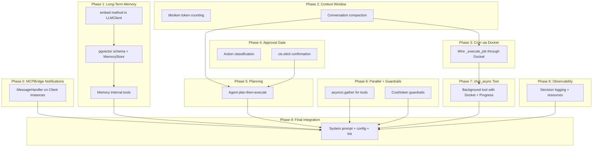

# Full Autonomous Agent Upgrade

Twelve gaps stand between the current agent and a truly autonomous system. This plan addresses each one, organized into 9 implementation phases based on dependencies.



---

## Phase 0: MCPBridge Client Notifications

**New addition** -- Currently [`bridge/manager.py`](src/fast_mcp_agent/bridge/manager.py) creates `Client()` instances with no `message_handler`. If RivalSearch, Playwright, or Google Workspace MCP servers update their tool lists at runtime, our cached tool registry goes stale silently.

Add a `BridgeNotificationHandler` subclass of `MessageHandler`:

```python
# In bridge/manager.py
from fastmcp.client.messages import MessageHandler

class BridgeNotificationHandler(MessageHandler):
    """Auto-refresh tool caches when connected MCP servers change their tools."""

    def __init__(self, bridge: "MCPBridge", source: str):
        self._bridge = bridge
        self._source = source

    async def on_tool_list_changed(self, notification) -> None:
        client = self._bridge._get_client(self._source)
        if client:
            new_tools = await self._bridge._discover_tools(client, self._source)
            if self._source == "rival":
                self._bridge._rival_tools = new_tools
            elif self._source == "pw":
                self._bridge._pw_tools = new_tools
            elif self._source == "gw":
                self._bridge._gw_tools = new_tools
            self._bridge._build_routing()
            logger.info("Tool list refreshed for %s (%d tools).", self._source, len(new_tools))
```

Pass it when creating each client:

```python
self._rival_client = Client(
    self._settings.rival_search_url,
    message_handler=BridgeNotificationHandler(self, "rival"),
)
```

---

## Phase 1: Long